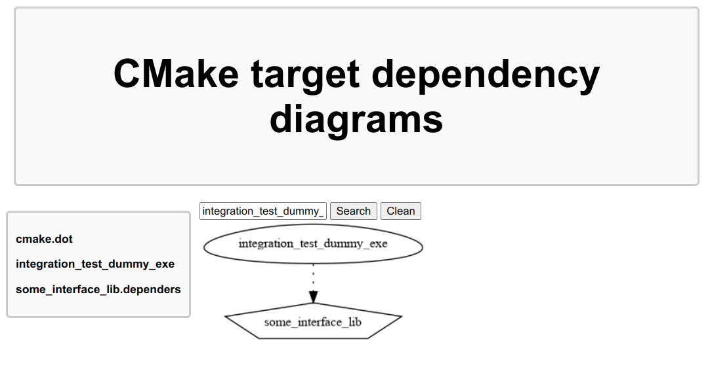

# CMakeDependencyDiagram

CMakeDependencyDiagram is a small cmake module that extends the [CMakeGraphVizOption](https://cmake.org/cmake/help/latest/module/CMakeGraphVizOptions.html) functionality by providing a basic html page to browse dependency diagram of your cmake targets. It is a drop-in addition to your project and should not require significant changes.

##  Usecase

You are working on a CMake project and would like to easily visualize Diagram of a target dependencies in a web browser, either because of

- troubleshooting the build of a target
- pure project documentation

## How to

Take a look at the [integration test example](tests/integration_test/CMakeLists.txt)

1. Install the `CMakeDependencyDiagram` package on your system. See [Installation](#installation)

2. Include the `CMakeDependencyDiagram` in your CMakeLists.txt

```cmake
include("/usr/share/CMakeDependencyDiagram/CMakeDependencyDiagram.cmake")
```

3. When configuring the project, pass the `--graphviz="$BUILD_DIR"/cmake.dot` option to cmake, with `BUILD_DIR` being the build directory. For instance:

```cmake
cmake -S integration_test -B "$BUILD_DIR" --graphviz="$BUILD_DIR"/cmake.dot
```

4. When building the project, specify building the target `cmake-dependency-Diagram` (**The Diagram are not built by default witht the "ALL" target**) For instance:

```cmake
cmake --build "$BUILD_DIR" --target cmake-dependency-Diagram
```

5. Visualize the target dependency interactively by running

```bash
xdg-open "$BUILD_DIR"/CMakeDependencyDiagram/index.html
```

You should see a web page like this that allows you to find target and visualize their dependencies.



## Installation

### Ubuntu 22 (Jammy Jellyfish)

```bash
sudo add-apt-repository ppa:maxime-haselbauer/cmake-dependency-diagram
sudo apt update
sudo apt install cmake-dependency-diagram 
```

### From source (any debian)

```bash
git clone git@github.com:renn0xtek9/CMakeDependencyDiagram.git
cd CMakeDependencyDiagram
./install_build_dependencies.sh
make local_debian_install
```
